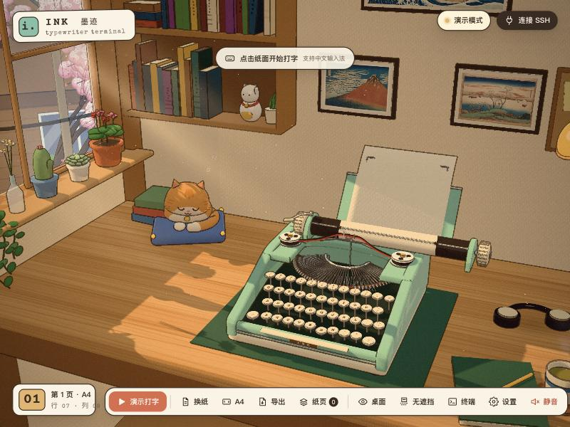
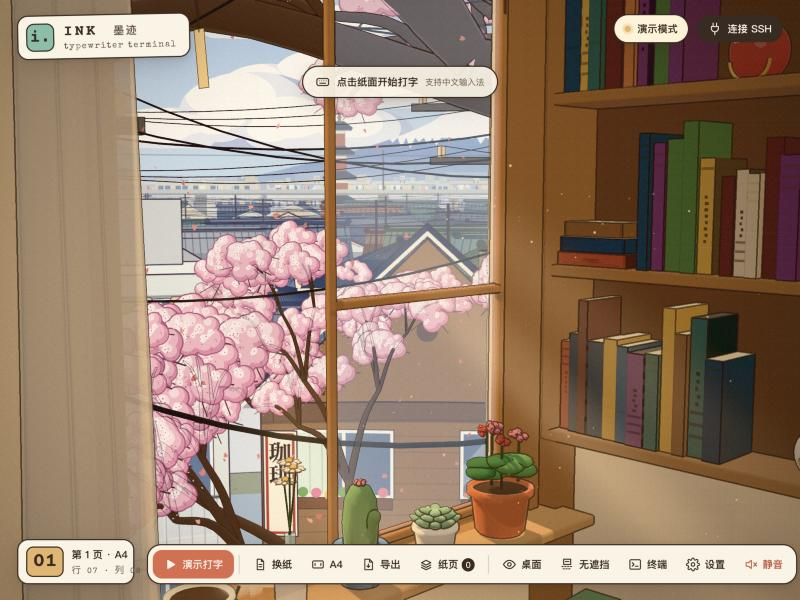
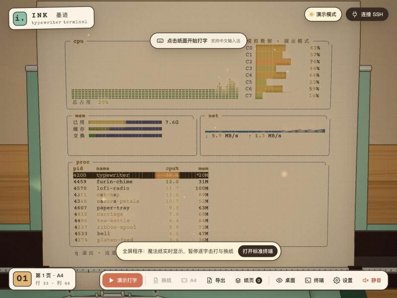
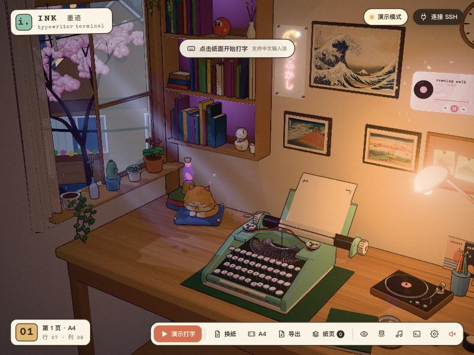
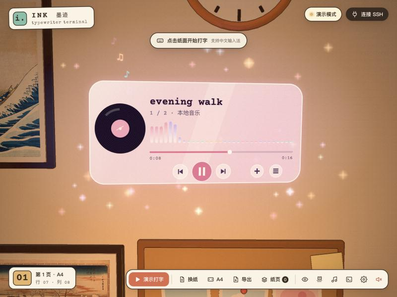
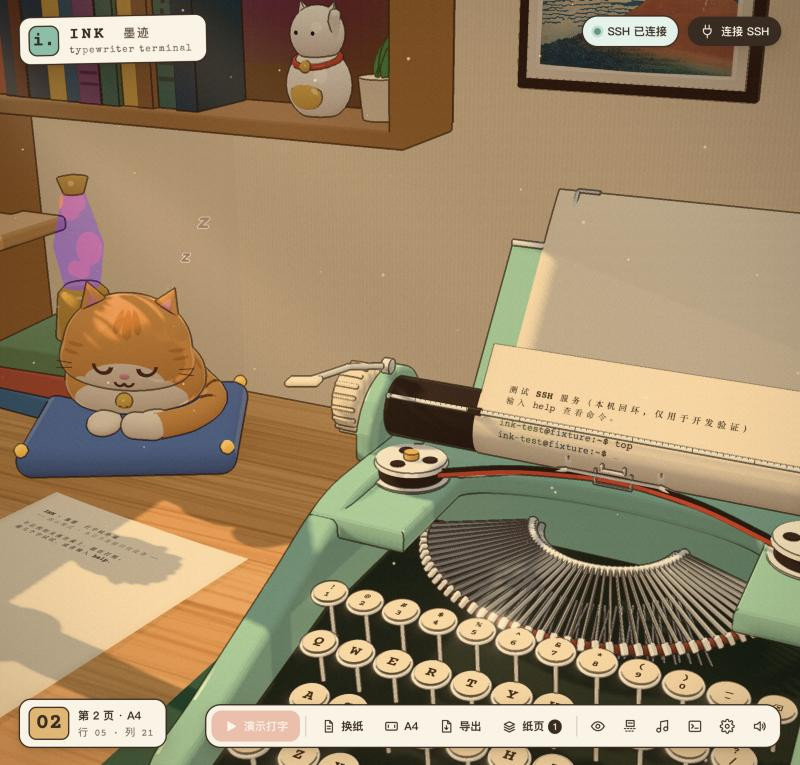
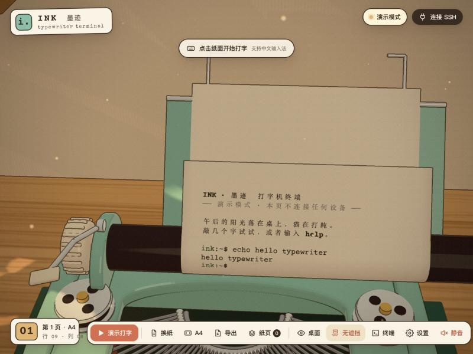

# INK · 墨迹 — 三渲二 lofi 打字机终端

[在线演示](https://ink-typewriter-lofi.xuyuan597.chatgpt.site) · [源码](https://github.com/xyuuii/typerterm) · [MIT 许可证](LICENSE)

一台放在日式 lofi 小书房里的机械打字机。窗外是一幅动画背景式的街景——对街的咖啡馆和晾着被子的阳台、樱花行道树、成片的瓦屋顶、高架上驶过的电车、五重塔和富士山；屋里有唱片机、霓虹灯牌、熔岩灯、吊着的绿萝，一只 Q 版橘猫在坐垫上打盹，墙上浮着一块玻璃质感的音乐播放器。纸就是终端：每个字都在字杆击打到纸上的那一刻才落墨；btop 这类全屏程序直接显示在这张纸上，变化的字会泛出金光。墙上的画可以换成你自己的图片，音乐可以放你自己的歌。可以只在浏览器里玩演示，也可以运行本机服务连接你自己的 SSH 设备。



| 窗外的街景 | 全屏程序直接显示在纸上 |
|---|---|
|  |  |
| **房间（夜晚）** | **悬浮的音乐播放器** |
|  |  |
| **Q 版猫** | **无遮挡视图** |
|  |  |

截图都是应用内浏览器里的实际 WebGL 渲染。

## 快速开始

需要 Node.js ≥ 22.12，以及支持 WebGL 2 的浏览器。

```bash
git clone https://github.com/xyuuii/typerterm.git
cd typerterm
npm install
npm run dev          # 演示版：打开 http://127.0.0.1:5181 （不连接任何设备）
```

连接真实 SSH 设备（本机版）：

```bash
npm start            # = npm run build && npm run bridge
```

终端会打印本次实际监听的 `http://127.0.0.1:端口` 和随机“本地访问口令”。打开这个地址 → 右上角“连接 SSH” → 填口令、主机、端口、用户名、密码或私钥 → **核对主机指纹** → 连接。服务只监听 127.0.0.1；密码/私钥只用于这次认证，不写入浏览器存储或日志。

音乐、图片和设置按浏览器来源地址保存。为在重启本机服务后继续读取同一份数据，可以指定一个空闲的固定端口：`INK_PORT=5182 npm start`（macOS / Linux）。在线演示和 `npm run dev` 不提供 SSH 桥接；真实连接请打开 `npm start` 打印的地址。

```bash
npm run build        # 桥接测试会读取 dist/，首次测试前需要构建
npm test             # 单元测试 + SSH 桥接集成测试（临时回环 SSH 服务，不碰你的设备）
npm run fixture      # 开发用：本机回环的假 SSH 服务（随机密码，假 shell，不执行任何命令）
```

## 怎么玩

- **点纸面**开始打字，支持中文输入法：拼音以铅笔字样先出现在纸上的光标处，系统的候选框会出现在正在打的那一行**下方**，不再挡住纸面。拖动旋转、右键平移、滚轮缩放；拖镜头不会抢走输入焦点。
- 也可以**用鼠标点键帽**，点左侧的**回车杆**就是回车。
- **换纸**：抽出当前纸页放到桌边那一摞上，卷进新纸。打满一页、或执行 `clear` 也会自动换纸。点桌上那一摞纸可以打开“纸页”列表。
- **纸张规格**：A4 竖版（46 列 × 33 行）、16:9 横版（66 × 15）、1:1 方形（46 × 21）。切换时当前页先归档，终端随之改尺寸（SSH 会同步 PTY 尺寸）。
- **导出**：当前页 PDF / 全部纸页 PDF / 纯文本。每打完一页，底部会提示“导出这页 PDF”。PDF 页面尺寸与纸张规格一致（A4 为 210 × 297 mm，约 300 dpi）。
- **全屏程序**（btop、htop、vim、less…）：直接显示在打字机里的这张纸上——纸往上送，整块屏幕露在压纸杆上方，镜头正对它；变化的字会泛出金光、冒几点星光。终端临时放大到至少 80×24（可在设置里关掉），退出后恢复原来的纸页、尺寸和镜头。
- **无遮挡**：工具栏按钮，把纸前的字导、卡纸指、压纸杆和色带整个隐藏，看清正在打的那一行。
- **视角**：桌面 / 阅读（正对纸面）/ 房间。
- **音乐**：工具栏“音乐”或直接点墙上的玻璃播放器，添加电脑里的音频文件（mp3、m4a、ogg、wav、flac，可多选）。播放/暂停、上一首/下一首、拖动进度、音量、列表循环/单曲循环；播放时唱片机的唱臂落下、唱片转起来。歌曲只存在本机浏览器里，刷新后还在。
- **换成你的图片**：点墙上的浮世绘或软木板上的拍立得（鼠标悬停有提示），选一张图片，会按画框比例居中裁切贴上去；设置里可以逐个“换图”或“恢复”。
- **终端**：标准 xterm 视图，**停靠在屏幕一侧**，三维画面自动让开，打字机仍然可见；用来选择复制、精确编辑。Esc 留给终端里的程序（vim 等），面板用 × 或工具栏按钮关闭。
- **设置**：纸色（象牙白/和纸/樱花/抹茶/天空）、光线（午后/黄昏/夜晚）、亮度、机械音量、环境音（风铃、鸟叫、房间底噪）、纸张挺度、机械动画开关、全屏程序放大、画质、墙上的画和照片。
- 演示模式命令：`help`、`demo`（自动打一首小诗，演示走纸和满页出纸）、`btop`（模拟的系统监视器，演示全屏程序上纸，数据是假的）、`echo …`、`colors`、`screen`、`clear`、`date`、`about`。

## 功能一览

**房间与窗外**
- 日式 lofi 书房：两扇推拉窗（一扇半开）、卷起的竹帘、纱帘、风铃；窗台上的天竺葵、多肉、仙人掌、雏菊、绿萝；墙上的书架（满架的书、招财猫、达摩、小相框、干花瓶，搁板下的紫色灯带）、霓虹灯牌（月亮 + “夜ふかし”）、三幅浮世绘、软木板上的三张拍立得、挂钟（走真实时间）、空调、串灯、麻绳吊篮里的绿萝；桌上有打字机毡垫、唱片机和靠墙的唱片封套、熔岩灯、猫、茶（冒热气）、书、耳机、笔记本、笔筒、台灯。
- 猫：自己画的 Q 版橘色虎斑，圆脸靠在前爪上睡觉，◡ ◡ 闭眼、ω 嘴、腮红、红项圈和小铃铛，会呼吸、抖耳朵、摆尾巴、飘“z”；行末铃响时会抬头竖耳朵。
- 窗外是**分层绘制的动画背景**，相机移动时有视差：对街七户人家（阳台晾衣服、被子、空调外机、黑猫、“珈琲”咖啡馆招牌）、樱花行道树、电线杆和下垂的电线、几十排瓦屋顶、高架铁路（电车约每 40 秒驶过）、澡堂烟囱、神社、五重塔、远处的城市和铁塔、富士山、卡通积云。黄昏整体变暖，夜晚家家亮灯、路灯亮起、夜樱、满天星。院子里老樱花树的花瓣会从半开的窗户飘进来落在窗台和桌上。

**三渲二**：卡通材质（分段明暗 + 硬边高光 + 轮廓光）、后期描边（法线/深度边缘，暖棕色线条，远处渐淡）、柔和泛光、暖色调颗粒；窗外物体有单独的空气透视和偏冷的明暗。

**打字机与纸**
- 42 根字杆排成扇形，每根绕自己的转轴摆起，**全部汇聚到同一个打印点**（数值验证），字锤斜装、撞击时与纸面贴平。
- 正在打的那一行永远在打印点上；字导、色带平时都在打印行下方，**卡纸指和压纸杆刻度尺是透明塑料**——当前行和上一行都不会被挡住。
- 打字时小车向左一格一格走，回车时向右滑回、回车杆被拉动；进纸时压纸辊和旋钮按纸的移动量转动；色带抬起器在每次击打时把色带抬到纸前；大写字母时字篮下沉。
- **墨迹在字杆接触纸面的那一刻才出现**（xterm 已解析的内容进入击打队列；延迟有上限，大量输出时快速追平）。
- 打字机做不到的事交给“魔法”：远端删字、覆盖（退格、进度条）时，那个格子会闪一下金光、冒几点星光。
- 纸张是按弧长铺在路径上的细分曲面：绕压纸辊、压纸杆处夹持、上方自由段随长度和挺度后仰；打满一页后继续送纸、抽出，在空中弯曲着落到桌边那一摞上。

**全屏程序直接上纸**：整块屏幕排进当前这张纸的文字区，颜色转成纸上的墨色（背景是一层淡水彩），**刚变化的字泛出琥珀金光并冒出星光**，然后沉回墨色；制表线（─│╭╮）、方块（▁▂▃█）、盲文点阵（⣿，btop 的曲线图）都按格子精确绘制；支持 256 色和真彩色；光标按程序的显示/隐藏状态画出；同步输出模式（DEC 2026）期间不读半帧。

**音乐与图片**：悬浮的磨砂玻璃播放器（旋转唱片、滚动曲名、频谱、进度、按钮、光晕、星点、飘出的音符），与唱片机联动；音乐经 Web Audio 单独的总线播放，静音时一起静音、切到后台不停。你的歌和图片只保存在本机浏览器的 IndexedDB，不会上传。

**声音**：全部在浏览器里合成——字杆击打（8 种变化，含键回弹与擒纵声）、空格、换行棘轮、回车滑行与撞停、行末铃、卷纸、抽纸、风铃（与风铃摆动同步）、鸟叫、全屏程序上纸时的轻铃；小房间混响。**都是合成音色，不是实机录音。**

## 项目结构

| 路径 | 内容 |
|---|---|
| `index.html`、`src/main.js`、`src/styles.css`、`src/icons.js` | 界面、工具栏、设置、纸页列表、连接对话框、终端停靠面板、输入法定位 |
| `src/engine/experience.js` | 场景生命周期、相机视角与让位、xterm、换纸流程、全屏程序上纸、墙上物件的点击与悬停、导出 |
| `src/engine/toon.js` | 三渲二材质与后期管线（描边、泛光、调色） |
| `src/engine/room.js` | 房间、窗户、光照预设、光柱、浮尘、风铃、猫的坐垫、画框位与音乐状态 |
| `src/engine/street.js` | 窗外：绘制层的组装、天空、电车、电线杆与电线、樱花树（枝干 + 花团卡片）、花瓣、飞鸟、时段 |
| `src/engine/paint.js` | 窗外的“画”：房屋投影与绘制、屋顶/窗/阳台细节、城市、富士山、五重塔、高架、云、花团图集 |
| `src/engine/decor.js` | 书架、浮世绘（画框位）、空调、桌面小物、接触阴影 |
| `src/engine/lofi.js` | 唱片机、唱片封套、霓虹灯牌、熔岩灯、吊篮绿萝、灯带、拍立得（画框位） |
| `src/engine/cat.js` | Q 版猫（程序建模、画在贴图上的花纹、表情、动作） |
| `src/engine/music.js`、`src/engine/player3d.js`、`src/engine/media-store.js` | 音乐播放与频谱 / 墙上的玻璃播放器 / 本机 IndexedDB 存储 |
| `src/engine/magic.js` | 全屏程序读屏、星光粒子、制表符/方块/盲文绘制 |
| `src/engine/typewriter.js` | 打字机模型与机械动画 |
| `src/engine/geometry.js` | 共享机械尺寸：压纸辊、打印点、纸路径（弧长参数化） |
| `src/engine/paper.js` | 机内纸张曲面、魔法修正的发光、落桌纸页动画 |
| `src/engine/ink.js` | 纸张规格、版面、打字机墨迹渲染（纸面与 PDF 共用） |
| `src/engine/mechanism.js` | 纸面与终端状态的同步：击打队列、落墨时机、小车/走纸动力学、延迟上限 |
| `src/engine/pages.js` | 按纸页追踪 xterm 缓冲区（marker）、归档（复制单元格数据） |
| `src/engine/sound.js` | 合成音效 |
| `src/engine/pdf.js` | 最小 PDF 写入器（每页一张 JPEG） |
| `src/engine/session.js`、`bridge/server.mjs` | 浏览器端 SSH 会话 / 本机同源桥接（协议见 `docs/PROTOCOL.md`） |
| `src/engine/demo-shell.js` | 演示会话与模拟监视器（页面内模拟，不执行任何命令） |
| `public/assets/` | 下载的素材：三幅浮世绘（来源与许可见下） |
| `tests/core.test.mjs`、`bridge/bridge.test.mjs` | 测试 |
| `scripts/dev-ssh-fixture.mjs` | 开发用回环假 SSH 服务 |
| `docs/DESIGN.md` | 美术与实现说明、近似范围、实测记录 |

## 素材与许可

本项目原创代码与文档采用 [MIT License](LICENSE)。第三方素材、字体和依赖保留各自许可证，详见 [THIRD_PARTY_NOTICES.md](THIRD_PARTY_NOTICES.md)。用户添加的音乐和图片不包含在仓库中。

| 文件 | 内容 | 来源 | 许可 |
|---|---|---|---|
| `public/assets/great-wave.jpg` | 葛饰北斋《神奈川冲浪里》 | [The Met 45434](https://www.metmuseum.org/art/collection/search/45434) | Open Access，CC0 |
| `public/assets/red-fuji.jpg` | 葛饰北斋《凯风快晴》 | [The Met 36490](https://www.metmuseum.org/art/collection/search/36490) | Open Access，CC0 |
| `public/assets/gotenyama-sakura.jpg` | 歌川广重《御殿山夕樱》 | [The Met 45298](https://www.metmuseum.org/art/collection/search/45298) | Open Access，CC0 |

其余模型（包括猫）、房间、窗外街景、纹理、图标和全部音效都由本仓库代码生成。字体与依赖的许可见 `THIRD_PARTY_NOTICES.md`。

## 已经实际验证的

- `npm test`：6 项全部通过——PDF 结构与 xref；纸路径不拉伸（步长误差 < 2%）、不穿过压纸辊和桌面、分段处连续；三种纸张版面在桥接允许的尺寸内且 PDF 比例一致；“墨迹只在接触时出现、按打字顺序”；“大量输出在延迟上限内追平”；SSH 桥接集成测试（回环、Host/Origin/口令拒绝、指纹、rekey、UTF-8 分包、Ctrl+C、resize、512 KB 流控）。
- 在应用内浏览器（Chromium，WebGL 2）里实际操作：键盘输入与回显、换纸、满页出纸落桌、`clear` 换纸、A4 ↔ 16:9、PDF 生成、三种光线（含夜晚窗户亮灯）、设置、纸页列表、终端停靠面板（画面让位）、演示 `btop` 直接显示在纸上（80×33、金色泛光不糊字）、无遮挡按钮、退格时纸面的魔法修正。
- 音乐：用页面里合成的两段 WAV 测试——添加、播放（频谱有数据、唱片机转动）、点墙上播放器的播放和列表按钮、刷新后播放列表从 IndexedDB 恢复且不自动播放。图片：生成一张图片放进大画框（居中裁切）、恢复原画、悬停提示、设置里的画框列表。没有用真实的 mp3/flac 文件测过各浏览器的格式支持。
- 输入法定位：隐藏的 xterm 输入框被放到打印行下方 22 px（数值核对）；系统候选框跟随它出现。没有在真实中文输入法下截图验证候选框位置。
- 通过本机桥接连接回环测试 SSH 服务（生产构建 + `npm run bridge`）：指纹与服务端一致、确认后才认证；在 SSH 里运行全屏程序时画面直接出现在纸上，PTY 依次收到 46×33 → 80×33 → 46×33（进入/退出全屏），退出后纸页内容和镜头复原，`exit` 回到演示模式。**这是测试服务通过，不等于已连接你的实际设备。**
- 流畅度（这台 Mac 的应用内浏览器，940×899 视口 × 像素比 2）：演示打字时高画质在桌面和房间视角都稳定 60 fps（最慢一帧约 20 ms）。GPU 计时查询每帧约 10–17 ms（高）、约 5 ms（低），这台机器上波动较大。每帧约 0.67 M 三角形、约 1150 次绘制调用（含描边与阴影通道）。其他设备未测。

## 需要知道的边界

- 当前版本的已知问题：运行全屏程序时导出当前纸页可能为空或内容错位，请先退出全屏程序再导出；归档超过 300 页后显示页码会重复。欢迎通过 [Issues](https://github.com/xyuuii/typerterm/issues) 提交可复现的问题。
- 打字机是原创的通用前击式结构，**不是任何实机的复刻**；尺寸、动作时间和声音都是调校值，不是测量数据。
- 纸张是参数化路径上的曲面，不是材料级物理仿真；抽纸落桌、全屏程序时的送纸是编排动画。
- 窗外街景是程序绘制的风格化“画”（分层的圆柱面 + 三维樱花和电线），不是任何真实地点；贴近窗户、斜到很偏的角度看时能看出是画。
- 中文等超出实体字模的字符属于数字扩展；远端的删字、覆盖、清屏属于数字显示行为，用“魔法修正”表现，不会假装是擦不掉的墨迹。全屏程序直接显示在纸上同样是数字扩展。
- 全屏程序放大到 80 列时，普通缓冲区的内容会被 xterm 重新折行，退出后再折回；有的 shell 会因为尺寸变化重画提示符。可在设置里关掉放大（btop 等需要 ≥80×24，太小时程序会自己提示）。
- 你的音乐和图片只存在当前浏览器（IndexedDB）；换浏览器、无痕窗口或清除网站数据后不会保留。
- 纸页归档最多保留 300 页，终端回滚 5000 行；刷新页面会丢失当前会话的纸页——重要内容请先导出。
- 主机指纹只在本次会话内固定（rekey 也校验同一把公钥）；不读取 `~/.ssh/config`、`known_hosts` 或 SSH Agent，也不跨会话记住已信任的主机。
- PDF 是图像型（保留打字机质感），文字不能被选择/搜索；需要文本请用“导出纯文本”。
- 移动端触屏输入、低端显卡、长时间运行的内存/帧率还没有测。
